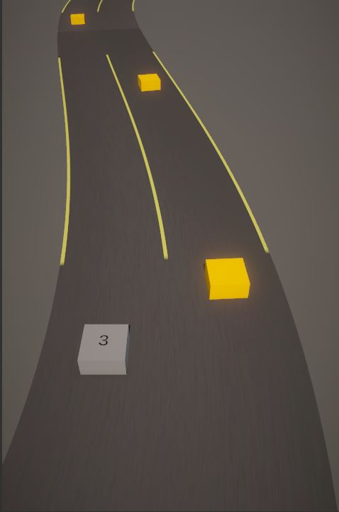

# Portfolio

## [Delivery of Death](https://ldjam.com/events/ludum-dare/53/delivery-of-death)

Delivery of Death is a novel-rpg game in which you will play as an assassin rat, whose job is to deliver death to whom it may concern. Game takes place in a fantasy animal kingdom, ruled by the undying Lion King. Imagine his suffering! Take your time and explore different locations of the kingdom, talk to npc and make your choices, make your path to the King and deliver him Death eventually. 

## [TestRunner](https://github.com/MountainInn/TestRunner)

A test task to show my knowledge of Splines. 

## [Ace Plane](https://github.com/MountainInn/Ace-Plane)

Little "Go Plane" clone. Work in progress.

## [Armello Concept Project (working title)](https://github.com/MountainInn/ArmelloConceptProject)
Turn based online strategy game. Unfinished and abandoned.
