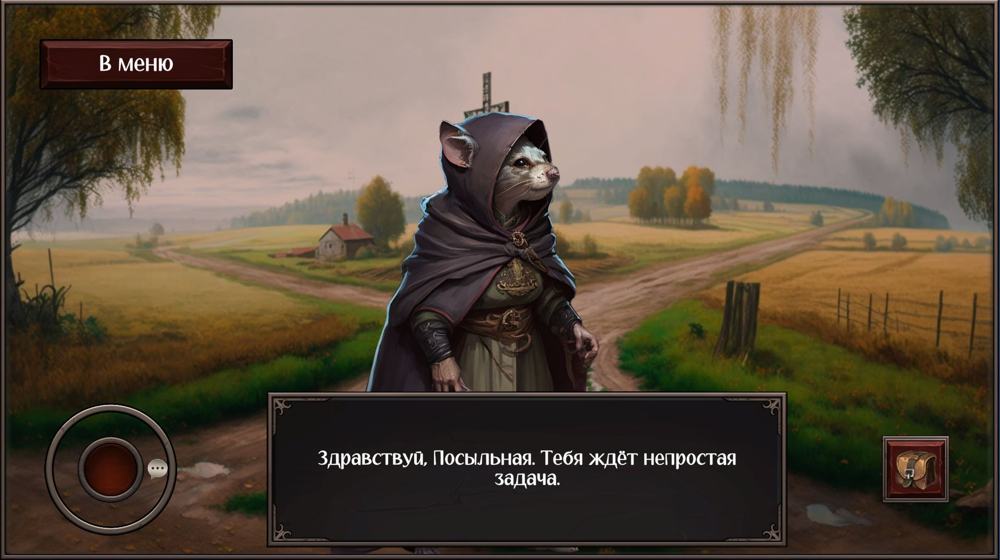

# Обо мне

# Мои проекты

|IdleRpgFighter *Дата* | Delivery of Death *Дата* |
|----|---|
|||
|*Описание айдла* | Визуальная новелла с элементами рпг. Сделана командой из 7 человек за 3 дня для гейм-джема Ludum Dare 53. В этом проекте большую часть кода написал я. Самая выдающаяся фича это кастомные ноды на пакете Visual Scripting, в которые геймдизайнеры переносили сценарий игры. |
|Ссылка на Гитхаб: https://github.com/MountainInn/IdleRpgFighter_Showcase/tree/main | Ссылка на Ludum Dare, с плэером: https://ldjam.com/events/ludum-dare/53/delivery-of-death |

| Нубик против Прешельцев *Дата* | Plunger Hero *Дата* |
|--|--|
|*Гифка*| *Гифка*|
|Проект для Яндекс.Игр в котором я реализовал казуальный раннер со стрельбой. Работал с SDK яндекса чтобы настроить показ рекламы, облачные сохранения и локализацию на 3 языка. | Клон успешной игры Plunger Hero |
|Ссылка на Яндекс игры: https://yandex.com/games/app/362612  | Ссылка на Яндекс игры: |
|Ссылка на Гитхаб: ываыва| Ссылка на Гитхаб: |

| Раннер с рисованием *Дата* | Простой раннер *Дата* | Клон Go Plane *Дата* |
|--|--|--|
| *Гифка* |*Гифка*| *Гифка*|
| *Описание* | *Описание* | *Описание* |
| Ссылка на гитхаб: | Ссылка на гитхаб: https://github.com/MountainInn/TestRunner | |

|Пошаговая онлайн стратегия *Дата*|
|--|
|*Гифка*|
|*Описание*|
|Ссылка на гитхаб: https://github.com/MountainInn/ArmelloConceptProject |
